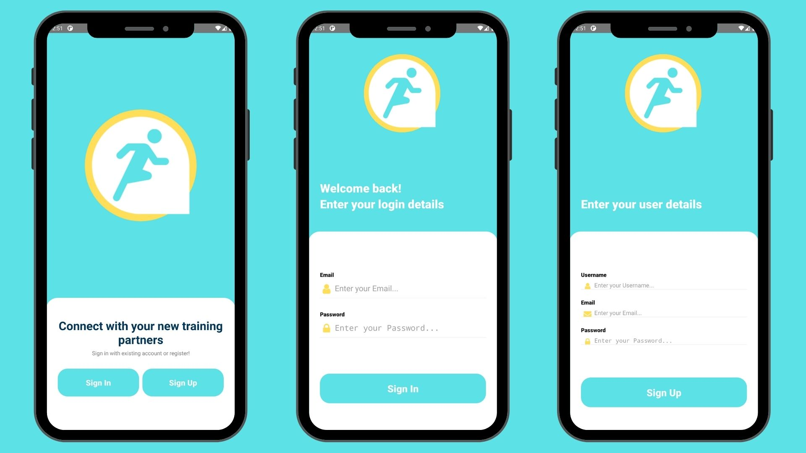
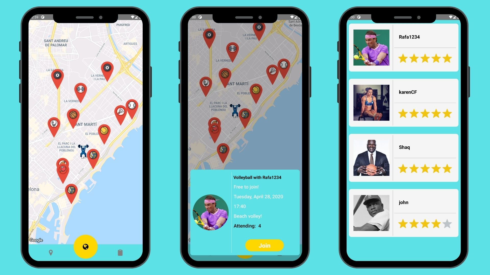
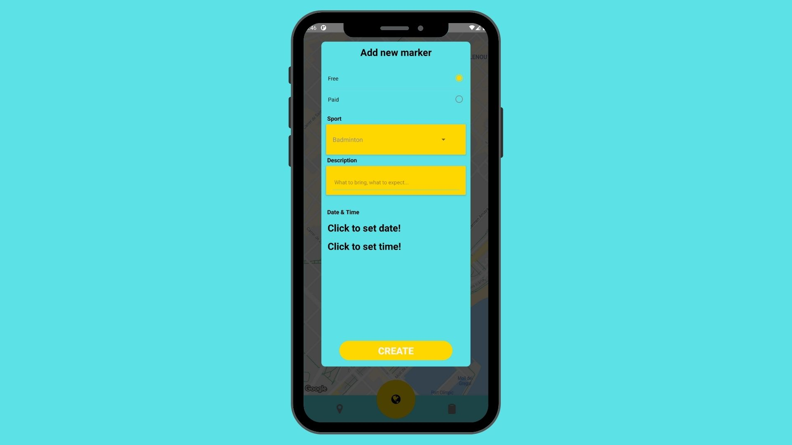
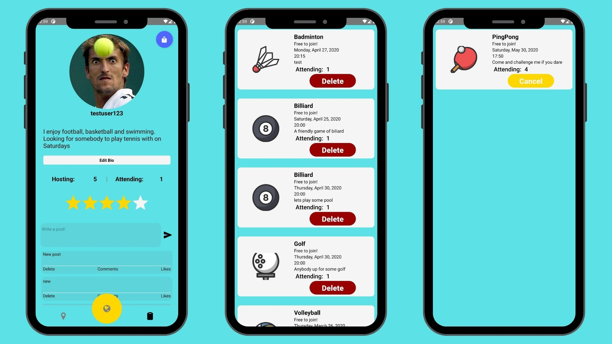

Do you like doing sports, but you are missing a sports buddy? 
Are you looking for a personal trainer to guide you through your fitness journey?
Are you a personal trainer and you want to reach more customers?
<br>
SportRadar is trying to allow all of this using a simple interface and google maps API familiar to everybody.
Simply choose the location of your workout on the map, choose the sport you want to do and wait for people to join, or just 
browse the map and join any of the public events created by other users.
<br>

## About
### Splash screen | SignIn Screen | SignUp Screen

<br>

### Map screen | About event | Users attending
After logging in, user lands on the map page where all the availible events are visible. By clicking an event pin a modal with event info appears. The user can either join the event, or cancel the attandance if already joined. Clicking the "Attending" text will show a list with all users attending the event.

<br>
### Create event modal
Pressing and holding a spot on the map will trigger a create event modal, used to create new events.

<br>
### User profile | Hosting | Attending
Pressing the right button on the bottom tab leads to the user profile page with the user information and dashboard with user posts. Clicking the "Hosting" will lead to a list of the events the user is hosting. There is a possibility to delete the event hosted by the user. Pressing the "Attending" text will lead to the list of events the user is Attending. It is possible to cancel the attendence. 


## Planned:
    - OAuth implementation using firebase
    - Following / followers functionality
    - Events filtering by distance from user
    - Post feed
    - Post likes / comments
    - Integratin sport places API to show places to do sports on the map


## Folder Structure
```
── client ** React Native Frontend built using React Native CLI
│   ├── GraphQL ** Declarations of client-side GraphQL mutations and queries
│   │
│   ├── Navigators ** Folder holding Navigator files
│   │
│   ├── assets ** Folder holding images and other project assets
│   │
│   ├── components ** Folder holding all components
│   │
│   ├── screens ** Folder holding screens divided by the navigator they belong to7
│   │   │
│   │   ├──LoginStack ** Login Stakc screens
│   │   │
│   │   ├──MainStack ** Main stack screens
│   │   │
│   │   └──ProfileStack ** Profile stack screens
│   │
│   └── App.js ** Main React Native file
│
├── server ** Apollo server backend
    ├── index.js ** Apollo server main file
    └── GraphQl ** General folder holding all Server logic
        ├──database ** General folder holding any database logic
        │  ├──database-models ** Folder holding all controllers used to access the database
        │  └──database-schemas ** Database schemas used to define the data shape of database tables
        │
        ├──resolvers ** Folder holding GraphQl resolvers
        └──schemas ** Folder holding GraphQl type definitions, mutation and query schemas


```
<br>

## Tech Stack
### Frontend
   
<br>
### Backend
    
 
